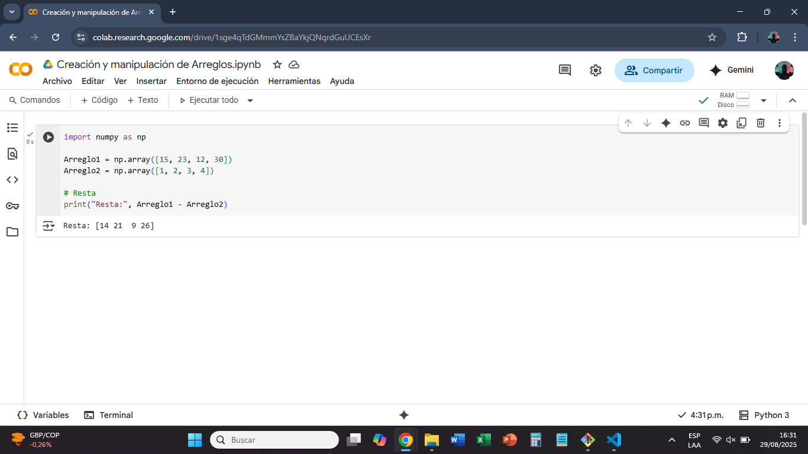
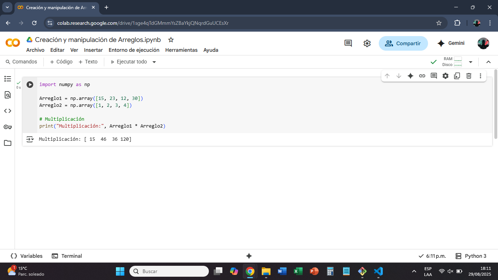
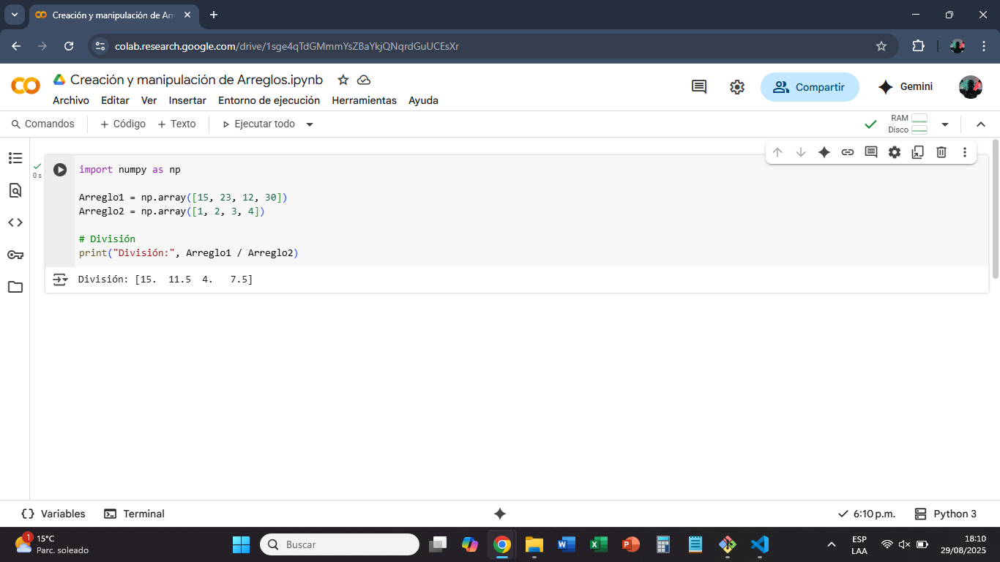
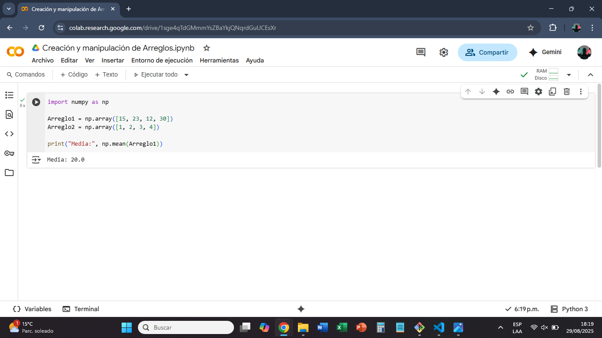
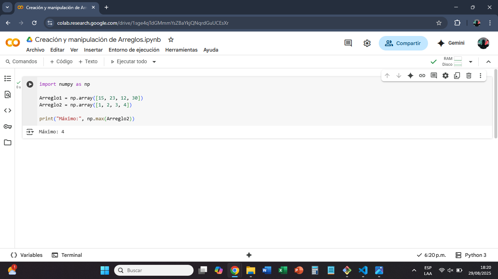
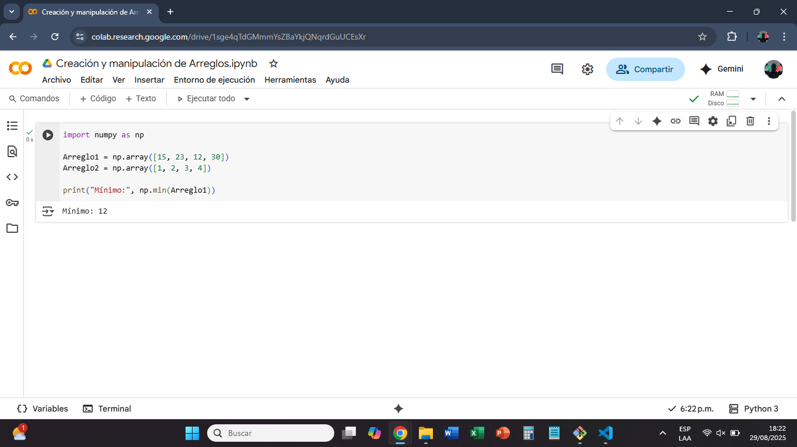

# Comandos Principales de NumPy y Pandas

CAD612023642C-A

**Estudiantes:** 
Daniela Alejandra Alvarez 
Cristian Camilo Naranjo 
Andres Felipe Venegas 
Juan Sebastián Bustos 

Universidad de Cundinamarca  
30 de agostos del 2025  
Chía

=======
## Creación y manipulación de Arreglos

### Creación de Arreglos

#### **np.array(lista)** 
Convierte una lista de Python en un arreglo de NumPy. 

#### **Arreglo bidimensional** 
Se pasa una lista de listas. 

#### **np.zeros((filas, columnas))** 
Crea un arreglo lleno de ceros.

#### **np.ones((filas, columnas))** 
Crea un arreglo lleno de unos.

#### **np.arange(inicio, fin, paso)** 
Crea un rango de números.

#### **np.random.rand(filas, columnas)** 
Genera números aleatorios entre 0 y 1.

### Cambiar forma de un arreglo (reshape)

#### **reshape(n, m)** 
Cambia la forma del arreglo, pero sin alterar sus valores.

### Concatenación de arreglos

#### **np.concatenate((a, b))** 
Une dos arreglos.

En 2D se puede elegir el eje (axis): 
- axis=0: Une por filas
- axis=1: Une por columnas 

### Operaciones Básicas

#### **Suma** 

#### **Resta** 

#### **Multiplicación** 

#### **División** 

#### **Potencia** 

### Operaciones con funciones NumPy

#### **np.mean(arreglo)** 
Calcula la media (promedio).

#### **np.max(arreglo)**
Devuelve el valor máximo.

#### **np.min(arreglo)**
Devuelve el valor mínimo.

## B) NumPy -- Operaciones Estadísticas y Funciones Avanzadas

**Responsable:** Andres Felipe Venegas Hernandez

Esta sección cubre funciones estadísticas para el análisis de datos,
métodos para crear arreglos especializados y operaciones de álgebra
lineal.

### Funciones Estadísticas

Para estos ejemplos, usaremos el siguiente arreglo base:

CODIGO import numpy as np \# Arreglo para los ejemplos mi_arreglo =
np.array(\[2, 4, 6, 8, 10, 12\]) print(f"Arreglo base: {mi_arreglo}")

RESULTADO Arreglo base: \[ 2 4 6 8 10 12\]

EJERCICIO #1 CODIGO Suma de elementos: Calcula la suma de todos los
elementos en el arreglo. \# Usando np.sum() suma = np.sum(mi_arreglo)
print(f"La suma de los elementos es: {suma}")

RESULTADO La suma de los elementos es: 42

EJERCICIO #2 CODIGO Mean: Calcular la media aritmética de los elementos
del arreglo \# Usando np.mean() promedio = np.mean(mi_arreglo)
print(f"El promedio de los elementos es: {promedio}")

RESULTADO El promedio de los elementos es: 7.0

EJERCICIO #3 CODIGO \# Usando np.std() desviacion = np.std(mi_arreglo)
print(f"La desviación estándar es: {desviacion:.2f}")

RESULTADO La desviacion estandar es: 3.42

EJERCICIO #4 CODIGO \# Creando una secuencia de 0 a 20, de 2 en 2
secuencia_arange = np.arange(0, 21, 2) print(f"Arreglo con arange(0, 21,
2): {secuencia_arange}")

RESULTADO Arreglo con arange(0, 21, 2): \[ 0 2 4 6 8 10 12 14 16 18 20\]

EJERCICIO #5 CODIGO \# Creando una matriz de 2x4 con números aleatorios
matriz_aleatoria_decimal = np.random.rand(2, 4)
print("Matriz aleatoria de 2x4:")
print(matriz_aleatoria_decimal)

RESULTADO 
Matriz aleatoria de 2x4:
[[0.64860197 0.09059237 0.09140946 0.04148627]
 [0.19075457 0.35098679 0.98677383 0.55237791]]

EJERCIO #6  CODIGO \# Multiplicando arrays
matriz_A = np.array([[1, 2], [3, 4]])
matriz_B = np.array([[5, 0], [0, 5]])

producto = matriz_A @ matriz_B
print("Matriz A:\n", matriz_A)
print("\nMatriz B:\n", matriz_B)
print("\nProducto de A @ B:\n", producto)

RESULTADO

Matriz A:
 [[1 2]
 [3 4]]

Matriz B:
 [[5 0]
 [0 5]]

Producto de A @ B:
 [[ 5 10]
 [15 20]]

---

# Pandas - Creacion y manipulacion de DataFrames y Series

**Introducción a Pandas**
Pandas es una biblioteca de código abierto fundamental para la ciencia de datos y el análisis en Python. Su nombre proviene de "Panel Data", un término econométrico para referirse a conjuntos de datos multidimensionales. Proporciona estructuras de datos intuitivas, flexibles y de alto rendimiento diseñadas para trabajar con datos estructurados (tablas) y series temporales de manera eficiente. Su funcionamiento se basa en dos estructuras principales: Series (para datos unidimensionales) y DataFrames (para datos bidimensionales). Pandas se utiliza principalmente para la carga, limpieza, transformación, exploración y análisis de datos, integrando sus estructuras con otras bibliotecas del ecosistema científico de Python como NumPy, Matplotlib y Scikit-learn. Simplifica tareas complejas de manipulación de datos con una sintaxis clara y expresiva, actuando como una potente herramienta para convertir datos crudos en información valiosa.

## 1. Creacion de un DataFrame
Un DataFrame es una estructura de datos tabular similar a una hoja de calculo con filas y columnas etiquetadas.

**Codigo**
import pandas as pd

data = {
    'Nombre': ['Jose', 'Carmen', 'Ben', 'Maria'],
    'Apellido': ['Hernandez', 'Villalobos', 'Tennyson', 'Del Prado'],
    'Año de Nacimiento': [1973, 1979, 2005, 1963],
    'Ciudad': ['Tunja', 'Medellin', 'Bellwood', 'Bogota'],
    'Numero de Documento ': ['58496738', '456273812', '1078598612', '845621735']
}

df = pd.DataFrame(data)
print("DataFrame creado:")
print(df)

**Resultado:**
DataFrame creado:
   Nombre    Apellido  Año de Nacimiento    Ciudad Numero de Documento 
0    Jose   Hernandez               1973     Tunja             58496738
1  Carmen  Villalobos               1979  Medellin            456273812
2     Ben    Tennyson               2005  Bellwood           1078598612
3   Maria   Del Prado               1963    Bogota            845621735

Restricciones/Curiosidades: Las claves del diccionario se convierten en nombres de columnas. Las listas deben tener la misma longitud. Si no es así, se generará un ValueError.

Error Frecuente: Intentar crear un DataFrame con listas de longitudes diferentes.
data_erroneo = {'A': [1, 2], 'B': [3, 4, 5]}
df_err = pd.DataFrame(data_erroneo) # ValueError: All arrays must be of the same length

Funcionalidad Relevante: Se puede usar el parámetro index para definir una etiqueta personalizada para las filas (ej: index=['a', 'b', 'c', 'd']).

---

## 2. Creacion de una Series
Una Series es una estructura unidimensional, similar a una columna de un DataFrame.

**Codigo**
Nacimiento = pd.Series([1973, 1979, 2005, 1963, 2015, 1815, '2025', 2001], name='Año de Nacimiento')
print("Serie creada:")
print(Nacimiento)

**Resultado:**
Serie creada:
0    1973
1    1979
2    2005
3    1963
4    2015
5    1815
6    2025
7    2001
Name: Año de Nacimiento, dtype: object

Restricciones/Curiosidades: Tiene su propio índice, que por defecto son enteros secuenciales (0, 1, 2, ...) pero puede ser personalizado, como se muestra arriba. El atributo name es útil para identificar la Series al incorporarla a un DataFrame.

Error Frecuente: Confundir una Series de una columna con un DataFrame.
tipo_series = type(df['Edad']) # pandas.core.series.Series
tipo_df = type(df[['Edad']])   # pandas.core.frame.DataFrame (notar el doble corchete)

---

## 3. Carga de datos desde un archivo CSV
Pandas permite cargar datos desde archivos externos como CSV.
import pandas as pd

**Codigo**
url = 'https://raw.githubusercontent.com/JuanSebastianBustos/Actividades-Machine-Learning/refs/heads/C-pandas-dataframes/Procesadores.csv'
df_iris = pd.read_csv(url)

print("Datos cargados desde CSV:")
print(df_iris)

**Resultado:**
Datos cargados desde CSV:
          Nombre del Procesador Fabricante  Número de Núcleos  \
0          Intel Core i9-14900K      Intel                 24   
1           AMD Ryzen 9 7950X3D        AMD                 16   
2          Intel Core i7-14700K      Intel                 20   
3           AMD Ryzen 7 7800X3D        AMD                  8   
4          Intel Core i5-14600K      Intel                 14   
5             AMD Ryzen 5 7600X        AMD                  6   
6          Intel Core i9-13900K      Intel                 24   
7             AMD Ryzen 9 7900X        AMD                 12   
8                  Apple M3 Max      Apple                 16   
9                Apple M2 Ultra      Apple                 24   
10         Intel Core i7-13700K      Intel                 16   
11            AMD Ryzen 7 7700X        AMD                  8   
12         Intel Core i5-13600K      Intel                 14   
13             AMD Ryzen 5 7600        AMD                  6   
14          Intel Core i3-14100      Intel                  4   
15            AMD Ryzen 5 5600G        AMD                  6   
16      Intel Core Ultra 7 155H      Intel                 16   
17           AMD Ryzen 9 7945HX        AMD                 16   
18          Intel Xeon W9-3495X      Intel                 56   
19  AMD Threadripper PRO 7995WX        AMD                 96   

    Número de Hilos  Velocidad Base (GHz)  Velocidad Turbo (GHz)  \
0                32                   3.2                    6.0   
1                32                   4.2                    5.7   
2                28                   3.4                    5.6   
3                16                   4.2                    5.0   
4                20                   3.5                    5.3   
5                12                   4.7                    5.3   
6                32                   3.0                    5.8   
7                24                   4.7                    5.6   
8                16                   NaN                    NaN   
9                24                   NaN                    NaN   
10               24                   3.4                    5.4   
11               16                   4.5                    5.4   
12               20                   3.5                    5.1   
13               12                   3.8                    5.1   
14                8                   3.5                    4.7   
15               12                   3.9                    4.4   
16               22                   1.4                    4.8   
17               32                   2.5                    5.4   
18              112                   1.9                    4.8   
19              192                   2.5                    5.1   

    Memoria Caché L3 (MB)  TDP (W)     Socket  \
0                    36.0    125.0   LGA 1700   
1                   128.0    120.0        AM5   
2                    33.0    125.0   LGA 1700   
3                    96.0    120.0        AM5   
4                    24.0    125.0   LGA 1700   
5                    32.0    105.0        AM5   
6                    36.0    125.0   LGA 1700   
7                    64.0    170.0        AM5   
8                     NaN      NaN  Integrado   
9                     NaN      NaN  Integrado   
10                   30.0    125.0   LGA 1700   
11                   32.0    105.0        AM5   
12                   24.0    125.0   LGA 1700   
13                   32.0     65.0        AM5   
14                   12.0     60.0   LGA 1700   
15                   16.0     65.0        AM4   
16                   24.0     28.0        BGA   
17                   64.0     55.0        FP7   
18                  105.0    420.0   LGA 4677   
19                  384.0    350.0       sTR5   

                                        Uso Principal  
0                      Gaming y Creación de Contenido  
1                          Gaming de Alto Rendimiento  
2                     Gaming y Productividad Avanzada  
3                                              Gaming  
4                      Gaming y Productividad General  
5                  Gaming de Gama Media y Uso General  
6          Gaming y Creación de Contenido Profesional  
7                  Creación de Contenido y Multitarea  
8                       Profesionales Creativos (Mac)  
9                         Edición de Video y 3D (Mac)  
10                                Gaming y Multitarea  
11                             Gaming y Productividad  
12                               Gaming de Gama Media  
13                      Gaming de Entrada y Ofimática  
14                             Ofimática y Uso Básico  
15  Ofimática y Gaming Ligero (Con Gráficos Integr...  
16                     Portátiles de Alto Rendimiento  
17                     Portátiles Gaming de Alta Gama  
18          Estaciones de Trabajo de Alto Rendimiento  
19    Estaciones de Trabajo y Computación Profesional  

Restricciones/Curiosidades: Tiene decenas de parámetros para manejar casi cualquier variación de archivo CSV (sep para el delimitador, header para la fila de encabezados, na_values para definir valores missing, encoding para la codificación de caracteres).

Error Frecuente: No especificar el delimitador correcto o la codificación del archivo, lo que resulta en un DataFrame corrupto o un error de lectura.
Para un archivo separado por punto y coma y codificación Windows-1252
df = pd.read_csv('archivo.csv', sep=';', encoding='windows-1252')

---

## 4. Uso de `head()` para visualizar datos
Muestra las primeras filas del DataFrame (por defecto, 5).

**Codigo**
print("Primeras 3 filas del DataFrame:")
print(df_iris.head(3))

**Resultado:**
Primeras 3 filas del DataFrame:
  Nombre del Procesador Fabricante  Número de Núcleos  Número de Hilos  \
0  Intel Core i9-14900K      Intel                 24               32   
1   AMD Ryzen 9 7950X3D        AMD                 16               32   
2  Intel Core i7-14700K      Intel                 20               28   

   Velocidad Base (GHz)  Velocidad Turbo (GHz)  Memoria Caché L3 (MB)  \
0                   3.2                    6.0                   36.0   
1                   4.2                    5.7                  128.0   
2                   3.4                    5.6                   33.0   

   TDP (W)    Socket                    Uso Principal  
0    125.0  LGA 1700   Gaming y Creación de Contenido  
1    120.0       AM5       Gaming de Alto Rendimiento  
2    125.0  LGA 1700  Gaming y Productividad Avanzada  

Restricciones/Curiosidades: Por defecto, n=5. El método equivalente para ver las últimas filas es .tail().

---

## 5. Uso de `dtypes` para ver los tipos de datos
Muestra el tipo de dato de cada columna.

**Codigo**
print("Tipos de datos del DataFrame:")
print(df_iris.dtypes)

**Resultado:**
Tipos de datos del DataFrame:
Nombre del Procesador     object
Fabricante                object
Número de Núcleos          int64
Número de Hilos            int64
Velocidad Base (GHz)     float64
Velocidad Turbo (GHz)    float64
Memoria Caché L3 (MB)    float64
TDP (W)                  float64
Socket                    object
Uso Principal             object
dtype: object

Restricciones/Curiosidades: Los tipos object en Pandas often contienen strings, pero pueden ser contener mixed types o listas, lo que puede ralentizar las operaciones. Es una buena práctica convertirlos a tipos más específicos como category para variables categóricas.

Error Frecuente: Asumir el tipo de una columna sin verificarlo, lo que lleva a errores al realizar operaciones matemáticas en columnas de tipo string (object).

---

## 6. Seleccion de columnas
Se pueden seleccionar una o multiples columnas.

**Codigo**
columna_procesador = df_iris['Nombre del Procesador']
print("Columna 'Procesador':")
print(columna_procesador.head())

columnas_seleccionadas = df_iris[['Nombre del Procesador', 'Número de Núcleos']]
print("\nColumnas 'Procesador' y 'Nucleos':")
print(columnas_seleccionadas.head(3))

**Resultado:**
Columna 'Procesador':
0    Intel Core i9-14900K
1     AMD Ryzen 9 7950X3D
2    Intel Core i7-14700K
3     AMD Ryzen 7 7800X3D
4    Intel Core i5-14600K
Name: Nombre del Procesador, dtype: object

Columnas 'Procesador' y 'Nucleos':
  Nombre del Procesador  Número de Núcleos
0  Intel Core i9-14900K                 24
1   AMD Ryzen 9 7950X3D                 16
2  Intel Core i7-14700K                 20

Error Frecuente y más importante: Intentar seleccionar múltiples columnas con un solo corchete. df['col1', 'col2'] lanzará un error. La sintaxis correcta es usar una lista: df[['col1', 'col2']].

---

## 7. Conversion de tipos de datos
Podemos convertir el tipo de datos de una columna.

**Codigo**
df_iris['Fabricante'] = df_iris['Fabricante'].astype('category')
print("Tipo de datos de 'Fabricante' después de la conversión:")
print(df_iris['Fabricante'].dtype)

**Resultado:**
Tipo de datos de 'Fabricante' después de la conversión:
category

Restricciones/Curiosidades: El tipo category es muy eficiente en memoria y velocidad para variables que toman un número limitado de valores repetidos (género, país, categoría de producto). No se puede convertir una columna con valores no numéricos a un tipo numérico como int64 sin antes limpiarlos o transformarlos.

**Conclusión**
Pandas es la columna vertebral del análisis de datos en Python. Esta actividad demostró los pilares fundamentales para comenzar a trabajar con esta poderosa biblioteca: la creación de sus estructuras centrales (Series y DataFrames), la carga de datos desde fuentes externas, la inspección básica de los conjuntos de datos (head, dtypes) y las operaciones esenciales de selección y manipulación de columnas. Comprender en profundidad estos conceptos, junto con sus peculiaridades y errores comunes, sienta una base sólida para avanzar hacia técnicas más complejas de limpieza, transformación, agregación y visualización de datos, que son indispensables en cualquier flujo de trabajo moderno de ciencia de datos y machine learning. La práctica constante con estos comandos es clave para lograr fluidez y eficacia en el manejo de datos con Pandas.
